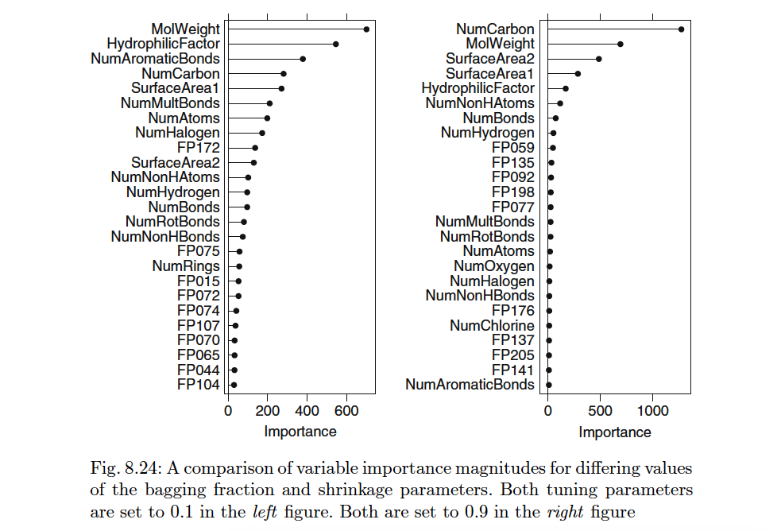

```{r setup, include=FALSE}
knitr::opts_chunk$set(
  echo = TRUE,         # Show R code in the document
  results = 'markup',  # Show R output
  warning = FALSE,     # Suppress warning messages
  error = FALSE,       # Suppress error messages
  message = FALSE,     # Suppress messages
  fig.align = "center" # Center-align all figures
)

# Set theme
ggplot2::theme_set(ggplot2::theme_minimal() + 
  ggplot2::theme(plot.title = ggplot2::element_text(size = 14, face = "bold"),
        axis.title = ggplot2::element_text(size = 12)))

# insert libraries used here
library(tidyverse)
library(AppliedPredictiveModeling)
library(caret)
library(glmnet)
library(mlbench)
library(lattice) 
library(nnet)
library(corrplot)
library(rpart)
library(VIM)
library(gbm)
```

# KJ 6.3

*Instructions*: A chemical manufacturing process for a pharmaceutical product was discussed in Sect. 1.4. In this problem, the objective is to understand the relationship between biological measurements of the raw materials (predictors), measurements of the manufacturing process (predictors), and the response of product yield. Biological predictors cannot be changed but can be used to assess the quality of the raw material before processing. On the other hand, manufacturing process predictors can be changed in the manufacturing process. Improving product yield by 1% will boost revenue by approximately one hundred thousand dollars per batch:

## KJ 6.3(a)

*Instructions*: Start R and use these commands to load the data: \> library(AppliedPredictiveModeling) \> data(chemicalManufacturingProcess)

The matrix processPredictors contains the 57 predictors (12 describing the input biological material and 45 describing the process predictors) for the 176 manufacturing runs. Yield contains the percent yield for each run.

### Approach - KJ 6.3(a)

The appropriate libraries will be loaded per the instructions. We will evaluate the dimensions of the data (number of rows and observations), confirm that yield is in the 1st column and is the output, and create a new data frame that excludes it.

### Analysis - KJ 6.3(a)

```{r kj-6.3.a.-analysis}
data(ChemicalManufacturingProcess)

dim(ChemicalManufacturingProcess)

yield <- ChemicalManufacturingProcess$Yield
predictors <- ChemicalManufacturingProcess[, names(ChemicalManufacturingProcess) != "Yield"]
```

## KJ 6.3(b)

*Instructions*: A small percentage of cells in the predictor set contain missing values. Use an imputation function to fill in these missing values (e.g., see Sect. 3.8).

### Approach - KJ 6.3(b)

We will use the knnImpute function to fill in the missing values and create a data frame to hold the data for the next step. The k-Nearest Neighbor (KNN) approach predicts a new sample using the K-closest (typically in distance) samples from the training set. By default, this function uses the 10 nearest neighbors which is what we will use in our analysis.

### Analysis - KJ 6.3(b)

```{r kj-6.3.b.-analysis}
preProc <- preProcess(predictors, method = "knnImpute")
predictors_imputed <- predict(preProc, newdata = predictors)
```

## KJ 6.3(c)

*Instructions*: Split the data into a training and a test set, pre-process the data, and tune a model of your choice from this chapter. What is the optimal value of the performance metric?

### Approach - KJ 6.3(c)

We will use the caret package to split the data into a test set and a training set, using 80% of the data for training (both the predictors (x) and the response (y), and will ensure that the distribution of the response data in yield is similar in both sets.

We will use the ridge regression function on this data to predict the response. Ridge regression is useful when you have many highly correlated predictors. It works by adding a penalty to the model so coefficients don't get too large which prevent it from overfitting. There is a tuning parameter in ridge regression called lambda. If lambda is large, the coefficients are shrunk towards zero, although all predictors are kept in the model. We will tune the parameters to find the configuration that leads to the smallest RMSE, which is our performance metric.

Cross validation is a common technique using multiple different combinations of data (folds) to test the model. In 10 fold cross validation we train the model on 9 folds and test on the 10th. The goal is to find the lambda that gives us the smallest RMSE.

### Analysis - KJ 6.3(c)

```{r kj-6.3.c.-analysis}

set.seed(123)
trainIndex <- createDataPartition(yield, p = 0.8, list = FALSE)
X_train <- predictors_imputed[trainIndex, ]
X_test  <- predictors_imputed[-trainIndex, ]
y_train <- yield[trainIndex]
y_test  <- yield[-trainIndex]

ridge_grid <- expand.grid(alpha = 0, lambda = 10^seq(-3, 3, length = 100))

set.seed(123)
ridge_model <- train(
  x = X_train, y = y_train,
  method = "glmnet",
  trControl = trainControl(method = "cv", number = 10),
  tuneGrid = ridge_grid,
  metric = "RMSE"
)
ridge_model$bestTune
min(ridge_model$results$RMSE)
```

The optimal tuning parameter for lambda is 2.15 which produced the lowest cross validated RMSE of 1.36 which indicates the model performed well using the ridge regression approach.

## KJ 6.3(d)

*Instructions*: Predict the response for the test set. What is the value of the performance metric and how does this compare with the resampled performance metric on the training set?

### Approach - KJ 6.3(d)

Next we will test this ridge model on the remaining data (X_test, and y_test from above), the test set. We are looking for the lowest RMSE and a high R squared.

### Analysis - KJ 6.3(d)

```{r kj-6.3.d.-analysis}
y_pred <- predict(ridge_model, newdata = X_test)

rmse_test <- RMSE(y_pred, y_test)
r2_test <- R2(y_pred, y_test)
rmse_cv <- min(ridge_model$results$RMSE)

cat("Test RMSE:", round(rmse_test, 3), "\n")
cat("Test R²:", round(r2_test, 3), "\n")
cat("Train RMSE (CV):", round(rmse_cv, 3), "\n")
```

The test RMSE is 1.299 which is lower than it was on the training set at 1.36. This indicates that the model generalizes well and that it may have underestimated its performance on the test data. The r squared (.50) means that the model explains 50% of the variation in the response.

## KJ 6.3(e)

*Instructions*: Which predictors are most important in the model you have trained? Do either the biological or process predictors dominate the list?

### Approach - KJ 6.3(e)

In ridge regression all variables stay in the model but some coefficients are shrunk towards zero, indicating they lower importance. We will run the model and look for the coefficients with the highest values, either positive or negative. In the output below I choose to list the 5 most influential variables.

### Analysis - KJ 6.3(e)

```{r kj-6.3.e.-analysis}
ridge_coef <- coef(ridge_model$finalModel, s = ridge_model$bestTune$lambda)
coef_df <- as.data.frame(as.matrix(ridge_coef))
coef_df$Feature <- rownames(coef_df)
colnames(coef_df)[1] <- "Coefficient"

coef_df <- coef_df[coef_df$Feature != "(Intercept)", ]
top_predictors <- coef_df[order(abs(coef_df$Coefficient), decreasing = TRUE), ]
head(top_predictors, 5)
```

The most influential predictors and their coefficients are:

ManufacturingProcess32: 0.222

ManufacturingProcess17: -0.192

ManufacturingProcess09: 0.187

ManufacturingProcess06: 0.179

ManufacturingProcess13:-0.174

Manufacturing predictors dominate the list.

## KJ 6.3(f)

*Instructions*: Explore the relationships between each of the top predictors and the response. How could this information be helpful in improving yield in future runs of the manufacturing process?

### Approach - KJ 6.3(f)

We will look at the value of the coefficients paying particular attention to those that are largest or smallest.

### Analysis - KJ 6.3(f)

The coefficients that are negative indicate that the process has a negative impact on product yield, meaning that reducing this variable could improve output. The largest positive coefficients mean that increasing those variables (or improving those manufacturing processes) could also increase yield. Refinements in these manufacturing processes, especially those with negative signs, may have the most impact on output.

# KJ 7.2

*Instructions*: Friedman (1991) introduced several benchmark data sets create by simulation. One of these simulations used the following nonlinear equation to create data: y =10 sin(πx1x2) + 20(x3 − 0.5)2 +10x4 +5x5 +N(0,σ2) where the x values are random variables uniformly distributed between [0, 1] (there are also 5 other non-informative variables also created in the simulation).

Tune several models on these data. Which models appear to give the best performance? Does MARS select the informative predictors (those named X1–X5)?

### Approach - KJ 7.2

We will tune three different models on these data using the KNN approach, the MARS approach, and the neural network approach and will compare RMSE and r-squared to determine the best approach. To begin, the predictor matrix will be converted to a data frame for better readability and visualization, and we will use pair plots and a correlation heatmap to explore relationships among predictors.

### Analysis - KJ 7.2

```{r kj-7.2-analysis}
set.seed(123)
trainingData <-mlbench.friedman1(200, sd = 1) 
 ## We convert the 'x' data from a matrix to a data frame > ## One reason is that this will give the columns names. 

trainingData$x <-data.frame(trainingData$x) ## Look at the data using featurePlot
  
featurePlot(x = trainingData$x, y = trainingData$y, plot = "pairs")

## This creates a list with a vector 'y' and a matrix > ## of predictors 'x'. Also simulate a large test set to > ## estimate the true error rate with good precision: > 

set.seed(123)
testData <-mlbench.friedman1(5000, sd = 1)
testData$x <-data.frame(testData$x)

featurePlot(
  x = trainingData$x[, 1:5],
  y = trainingData$y,
  plot = "pairs"
)

corrplot(cor(trainingData$x), method = "color")

```

The feature plot function recommended by the book created a scatter plot that is essentially useless, especially with the uninformative predictors. A subsequent plot removes them, but the usefulness remains unchanged. A correlation plot is at least legible, but again not that useful for data analysis.

We begin by tuning the KNN Model. This model predicts a value by averaging the outcomes of the k closest training points to a new observation. Pre-processing is used to center and scale the data. We chose a tune length of 10 meaning that 10 different values of the nearest neighbors will be tried.

```{r kj-7.2-analysis knn}
set.seed(123)
knnModel <-train(
x = trainingData$x,
y = trainingData$y, 
method = "knn",
preProcess = c("center", "scale"),
tuneLength = 10)
knnModel
```

The model used RMSE to select the optimal number of neighbors using the smallest value. The final model uses the 15 closest (by distance) training points (the nearest neighbors) to predict the outcome after centering and scaling the data as it had the smallest RMSE of 3.10. An issue with this approach is that it will evaluate the (by design) non-informative variables included in the data set.

```{r kj-7.2-analysis knn2}
knnPred <-predict(knnModel, newdata = testData$x) 
## The function 'postResample' can be used to get the test set ## performance values 
postResample(pred = knnPred, obs = testData$y)
```

On the test data, the KNN approach achieved an RMSE of 3.2. The R-squared of 0.65 means the model explains roughly 65% of the variation in the test set outcomes.

Next we tune the model using the MARS approach which builds piecewise linear regression models that can include hinge points to better fit the data. No pre-processing of data is needed in this approach.

```{r kj-7.2-analysis MARS}
set.seed(123)
marsModel <- train(
  x = trainingData$x,
  y = trainingData$y,
  method = "earth",
  tuneGrid = expand.grid(nprune = 2:25, degree = 1:2),
  trControl = trainControl(method = "boot", number = 25)
)
marsModel
```

Similarly, RMSE was used to select the optimal model using the smallest value. The model selected 12 "basis functions" or "pieces" (controlled by parameter "nprune") which represents the number of terms retained in the model and fit a quadratic model to each piece (hence the degree = 2).

```{r kj-7.2-analysis MARS2}
marsPred <- predict(marsModel, newdata = testData$x)
postResample(pred = marsPred, obs = testData$y)
summary(marsModel$finalModel)
```

The MARS model only selects informative variables, and it did correctly select only the informative variables (X1-X5) as set up in the problem. It also identified multiple hinge points, which lets the model change slope at that point.

On the test data, the MARS approach achieved an RMSE of 1.2. The R-squared of 0.94 means the model explains roughly 94% of the variation in the test set outcomes. With a small RMSE of 1.2 and a large R-squared, this model does a very good job of explaining variation in the data and appears to fit the data better than the KNN approach does.

Next we evaluate the neural net model and will need to center and scale the data as we did with KNN. This approach uses "weight decay" to penalize large coefficients to dampen the risk of overfitting.

```{r kj-7.2-analysis Neural}
set.seed(123)
nnetModel <- train(
  x = trainingData$x,
  y = trainingData$y,
  method = "nnet",
  preProcess = c("center", "scale"),
  linout = TRUE,     # continuous output, not classification
  trace = FALSE,     # suppress training output
  tuneLength = 10,
  trControl = trainControl(method = "boot", number = 25)
)
nnetModel
```

RMSE was used to select the optimal model by choosing the smallest value. The final model used 1 hidden unit and a decay parameter of 0.1. The hidden unit is part of the model’s hidden layer that helps it learn complex relationships in the data. The decay is a weight penalty that helps avoid overfitting by shrinking weights.

```{r kj-7.2-analysis Neural2}
nnetPred <- predict(nnetModel, newdata = testData$x)
postResample(pred = nnetPred, obs = testData$y)
```

On the test data, the neural network achieved an RMSE of 2.67. The R-squared of 0.71 means the model explains roughly 71% of the variation in the test set outcomes. RMSE is higher than it was in the MARS model and the R-squared is lower.

The MARS model appears to give the best performance and only uses informative predictors.

# KJ 7.5

*Instructions*: Exercise 6.3 describes data for a chemical manufacturing process. Use the same data imputation, data splitting, and pre-processing steps as before and train several nonlinear regression models.

## KJ 7.5(a)

*Instructions*: Which nonlinear regression model gives the optimal resampling and test set performance?

### Approach

In Exercise 6.3,the chemical manufacturing dataset missing predictor values were 
handled through imputing the values using k-nearest neighbors. Then, the data 
was split into training and test sets, and ridge regression was applied with 
10-fold cross-validation to model the relationship between predictors and product 
yield. Model performance was evaluated using RMSE and R², and identified the most influential process predictors affecting yield.

To determine which nonlinear regression model gives the optimal resampling and 
test set performance, these steps can be followed:
- Train multiple nonlinear regression models such as random forest or neural net.
- Use resampling techniques during training like k-fold cross-validation to estimate each model’s performance on unseen data.
- Collect the resampling performance metrics (i.e., lowest RMSE or highest R²).
- Apply each trained model to the test set.
- Compare both resampling and test set performance.
- Check for consistency between resampling and test results.

This can be performed by developing a function that:
(1) Trains the model using the train() function.
(2) Defines tuning parameters
(3) Extracts performance metrics (RMSE, R^2)
(4) Returns a list with model and performance metrics.

### Analysis - KJ 7.5(a)

```{r kj-7.2.a.-analysis}
### Using 6.3 analysis from above:
# Load the dataset
data(ChemicalManufacturingProcess)

# Separate response and predictors
yield <- ChemicalManufacturingProcess$Yield
predictors <- ChemicalManufacturingProcess[, names(ChemicalManufacturingProcess) != "Yield"]
# Impute missing values using k-NN
set.seed(123)
preProc <- preProcess(predictors, method = "knnImpute")
predictors_imputed <- predict(preProc, newdata = predictors)
# Split into Train/Test Sets
set.seed(123)
trainIndex <- createDataPartition(yield, p = 0.8, list = FALSE)

X_train <- predictors_imputed[trainIndex, ] # train set predictors
X_test  <- predictors_imputed[-trainIndex, ] # test set predictors
y_train <- yield[trainIndex] # train set response
y_test  <- yield[-trainIndex] # test set response

# creating a function that trains the model, extracts resampling performance metrics, and returns the model object and metrics.
train_and_evaluate <- function(X_train, y_train, method_name, X_test, y_test) {
  # Combine predictors (X_train) and response (y_train) into a single training data frame
  training_data <- data.frame(X_train, y = y_train)
  
  # Set up 10-fold cross-validation resampling parameters
  tr_control <- trainControl(
    method = "cv",      # Use cross-validation
    number = 10,        # 10 folds
    verboseIter = FALSE # Don't print training progress
  )
  
  # Define hyperparameter tuning grids based on the model type specified by 'method_name'
  tune_grid <- switch(
    method_name,
    # random forest: number of variables randomly sampled at each split
    "rf" = expand.grid(mtry = c(2, 4, 6)),
    # SVM with radial kernel: tuning sigma and cost parameters
    "svmRadial" = expand.grid(
      sigma = c(0.01, 0.05),
      C = c(0.25, 0.5, 1)
    ),
    # neural network: tuning number of hidden units (size) and weight decay (decay)
    "nnet" = expand.grid(
      size = c(5, 7, 9, 12),
      decay = c(0, 0.01, 0.1, 0.5)
    ),
    # k-Nearest Neighbors: tuning number of neighbors k
    "knn" = expand.grid(k = c(3, 5, 7, 9)),
    # Default if method_name not matched: no tuning grid
    NULL
  )
  
  # Train the model 
  model_fit <- train(
    # Formula: predict y using all other variables in training_data
    y ~ .,
    # The combined training data frame
    data = training_data,
    # The algorithm to use (e.g., "rf", "nnet") passed as a string
    method = method_name,
    # Resampling strategy defined above (10-fold CV)
    trControl = tr_control,
    # Hyperparameter tuning grid defined above
    tuneGrid = tune_grid,
    # Metric to optimize during tuning (RMSE)
    metric = "RMSE" 
  )
  
  # Generate predictions on the test set
  predictions <- predict(model_fit, newdata = X_test)
  
  # Calculate performance metrics on the test set: RMSE and R-squared
  test_metrics <- data.frame(
    # Root Mean Squared Error on test data
    RMSE = RMSE(predictions, y_test),
    # R^2 of test data
    Rsquared = R2(predictions, y_test)
  )
  
  # Return a list with:
  # trained model object, the best RMSE, best RMSE found during cross-validation (training), the test set performance metrics calculated above
  list(
    model = model_fit,
    best_rmse = min(model_fit$results$RMSE),
    test_metrics = test_metrics
  )
}

# Define a vector of model namesto iterate over (as defined by caret funct.)
models <- c("rf", "svmRadial", "nnet", "knn")

# loop over each model type, train and evaluate using the function above
results <- lapply(models, function(m) {
  train_and_evaluate(X_train, y_train, m, X_test, y_test)
})

# Name each element of results list by the corresponding model name for easy reference
names(results) <- models

# Extract test set metrics for each model, add a 'model' column for identification,
# then combine all into a single data frame for comparison
test_perf <- lapply(models, function(m) {
  results[[m]]$test_metrics |> 
    mutate(model = m)
}) |> 
  bind_rows()  # Combine list of data frames into one data frame
```

Based on the test performance metrics, the random forest gives the optimal resampling 
and test set performance. This is because the RMSE is the lowest value of the 
nonlinear regression models, and the $R^2$ is the highest. This indicates that
that the random forest model has the smallest average prediction error on the test 
data (low RMSE), meaning its predictions are close to the actual observed values. 

Additionally, the high $R^2$ shows that the model explains a large proportion of 
the variance in the response variable, reflecting strong predictive power and a 
good fit to the data. Together, these metrics suggest that the random forest 
model generalizes well and reliably captures the underlying relationships in the dataset.

## KJ 7.5(b)

*Instructions*: Which predictors are most important in the optimal nonlinear regression model? Do either the biological or process variables dominate the list? How do the top ten important predictors compare to the top ten predictors from the optimal linear model?

### Approach - KJ 7.5(b)

To answer which predictors are most important in the optimal nonlinear model, 
the predictors are extracted from the random forest model results. Importance 
scores from that model, using varImp(), are calculated. Then the list is reviewed to identify whether biological or process variables dominate the top predictors. 

Then, the nonlinear top predictors are compared to the linear model to see if 
similar variables drive performance or if the nonlinear model reveals additional 
key factors. This comparison highlights how different modeling approaches capture relationships in the data.

### Analysis - KJ 7.5(b)

```{r kj-7.2.b.-analysis}
# Extracting the rf model results
rf_model <- results[["rf"]]$model

# Extract variable importance
rf_varimp <- varImp(rf_model)

# View top 10 most important predictors
top10_varimp <- rf_varimp$importance |>
  as.data.frame() |>
  tibble::rownames_to_column(var = "Predictor") |>
  dplyr::arrange(dplyr::desc(Overall)) |>
  head(10)

# Linear model top predictors
coef_df <- coef_df[coef_df$Feature != "(Intercept)", ]
top_predictors_linear <- coef_df |>
  arrange(desc(abs(Coefficient))) |>
  slice_head(n = 10) |>
  select(Feature)

# Nonlinear model variable importance, e.g., rf_varimp from varImp()
# Convert to data frame and get top 10
top_predictors_rf <- rf_varimp$importance |>
  as.data.frame() |>
  tibble::rownames_to_column(var = "Feature") |>
  arrange(desc(Overall)) |>
  slice_head(n = 10) |>
  select(Feature)

# Compare the two lists
comparison <- tibble(
  Linear = top_predictors_linear$Feature,
  RandomForest = top_predictors_rf$Feature
)

# Finding common predictors
common_predictors <- intersect(top_predictors_linear$Feature, top_predictors_rf$Feature)
```
In the linear model, there are seven manufacturing predictors that have the highest importance whereas there are five from the random forest model. 
`r cat("Comparison of the top 10 of both models:\n")`
`r print(comparison)`

There are five variables that appear in the top ten important variables in both the linear and random forest model:
`r cat("Common predictors in top 10 of both models:\n")`
`r print(common_predictors)`


## KJ 7.5(c)

*Instructions*: Explore the relationships between the top predictors and the response for the predictors that are unique to the optimal nonlinear regression model. Do these plots reveal intuition about the biological or process predictors and their relationship with yield?

### Approach - KJ 7.5(c)
To complete part (c) the following steps are completed:
- Identify the predictors unique to the nonlinear model’s top 10.
- Plot each unique predictor vs. yield using suitable plots.
- Analyze the strength, direction, shape of relationship.
- Consider the behavior to the type of predictor (biological vs. process) and 
what it might mean for manufacturing.

### Analysis - KJ 7.5(c)

```{r kj-7.2.c.-analysis}
unique_rf_predictors <- setdiff(top_predictors_rf$Feature,top_predictors_linear$Feature)

train_data_7.5 <- X_train %>%
  mutate(Yield = y_train)

plot_unique_rf_predictors <- train_data_7.5 %>%
  select(Yield, all_of(unique_rf_predictors)) %>%
  pivot_longer(
    cols = -Yield,
    names_to = "Predictor",
    values_to = "Value"
  ) |> 
  mutate(Predictor = factor(Predictor)) # changing data class to factor

# 
ggplot(plot_unique_rf_predictors, aes(x = Value, y = Yield)) +
  geom_point(alpha = 0.6, color = "darkgreen") +
  # LOESS (Locally Estimated Scatterplot Smoothing) for nonlinear model
  geom_smooth(method = "loess", se = FALSE, color = "blue") +
  facet_wrap(~ Predictor, scales = "free_x") +
  theme_minimal() +
  labs(title = "Yield vs. Unique RF Predictors",
       x = "Predictor Value",
       y = "Yield")
```

The scatterplots of the five unique random forest predictors against yield reveal patterns not captured by the linear model. Two predictors (ManufacturigProcess28 and ManufacturingProcess31) exhibit a vertical striping pattern, indicating that yield varies significantly across a narrow range of predictor values. This suggests 
nonlinear or threshold effects. The ManufacturingProcess31 predictor is highly right-skewed, which can obscure linear trends and highlight the value of 
non-parametric modeling. The other predictors have less clear or more scattered relationships with yield, which highlights how the random forest model can capture complex patterns that simpler models might miss. Overall, these plots support the 
idea that nonlinear models are better suited for uncovering hidden structure in manufacturing or biological processes.

Biological predictors vary more naturally, while manufacturing process variables 
are tighter and skewed, suggesting that improving raw material consistency could 
have a bigger impact on yield.

# KJ 8.1 Recreate the simulated data from Exercise 7.2.

## KJ 8.1(a)

*Instructions*: Fit a random forest model to all of the predictors, then estimate the variable importance scores. Did the random forest model significantly use the uninformative predictors (V6 – V10)?

### Approach - KJ 8.1(a)

[insert approach explaination here].

### Analysis - KJ 8.1(a)

```{r kj-8.1.a.-analysis}
# insert analysis here
```

## KJ 8.1(b)

*Instructions*: Now add an additional predictor that is highly correlated with one of the informative predictors. Fit another random forest model to these data. Did the importance score for V1 change? What happens when you add another predictor that is also highly correlated with V1?

### Approach - KJ 8.1(b)

[insert approach explaination here].

### Analysis - KJ 8.1(b)

```{r kj-8.1.b.-analysis}
# insert analysis here
```

## KJ 8.1(c)

*Instructions*: Use the cforest function in the party package to fit a random forest model using conditional inference trees. The party package function varimp can calculate predictor importance. The conditional argument of that function toggles between the traditional importance measure and the modified version described in Strobl et al. (2007). Do these importances show the same pattern as the traditional random forest model?

### Approach - KJ 8.1(c)

[insert approach explaination here].

### Analysis - KJ 8.1(c)

```{r kj-8.1.c.-analysis}
# insert analysis here
```

## KJ 8.1(d)

*Instructions*: Repeat this process with different tree models, such as boosted trees and Cubist. Does the same pattern occur?

### Approach - KJ 8.1(d)

[insert approach explaination here].

### Analysis - KJ 8.1(d)

```{r kj-8.1.d.-analysis}
# insert analysis here
```

# KJ 8.2

*Instructions*: Use a simulation to show tree bias with different granularities.

### Approach - KJ 8.2

This question is asking us to run an experiment, or simulation, that shows how decision trees are biased, using different approaches to breaking up the predictor space, or granularities. A shallow tree with very few splits has "coarse" granularity which means that it is at risk of underfitting the data and missing patterns or interactions systematically (bias). However, "fine" granularity, or a deep tree, can over fit the data, making it less useful as a tool for prediction as it doesn't generalize well. We will use the data from the Friedman data set and will fit both a small tree (low granularity) and a big tree (high granularity), and will check RSME to evaluate performance. We will visualize the results to emphasize the difference.

### Analysis - KJ 8.2

```{r kj-8.2.-analysis}
# this replicates what was done in question 7.2 to create usable data in a data frame
set.seed(123)
trainingData <- mlbench.friedman1(200, sd = 1) 
trainingData <- data.frame(trainingData$x, y = trainingData$y)

set.seed(123)
testData <- mlbench.friedman1(5000, sd = 1)
testData <- data.frame(testData$x, y = testData$y)

# We will fit a shallow tree (coarse granularity, high bias) and determine RMSE
shallow_tree <- rpart(y ~ ., data = trainingData,
                      control = rpart.control(maxdepth = 2))
shallow_preds <- predict(shallow_tree, newdata = testData)
rmse_shallow <- RMSE(shallow_preds, testData$y)

# We will fit a deep tree (fine granularity, lower bias) and determine RMSE.
deep_tree <- rpart(y ~ ., data = trainingData,
                   control = rpart.control(cp = 0.0001))
deep_preds <- predict(deep_tree, newdata = testData)
rmse_deep <- RMSE(deep_preds, testData$y)

# We will print and compare RMSE
cat("Shallow Tree RMSE:", round(rmse_shallow, 3), "\n")
cat("Deep Tree RMSE:", round(rmse_deep, 3), "\n")

# Let's visually compare the actual data to the predictions by the shallow tree to see signs of bias
plot_data <- data.frame(
  Actual = testData$y,
  Pred_Shallow = shallow_preds,
  Pred_Deep = deep_preds
)

ggplot(plot_data, aes(x = Actual, y = Pred_Shallow)) +
  geom_point(alpha = 0.5, color = "red") +
  geom_abline(slope = 1, intercept = 0, linetype = "dashed") +
  labs(title = "Shallow Tree Predictions Show Bias",
       x = "Actual y", y = "Predicted y") +
  theme_minimal()

ggplot(plot_data, aes(x = Actual, y = Pred_Deep)) +
  geom_point(alpha = 0.4, color = "blue") +
  geom_abline(intercept = 0, slope = 1, linetype = "dashed") +
  labs(title = "Deep Tree: Predicted vs Actual",
       x = "Actual y", y = "Predicted y") +
  theme_minimal()

```
The shallow tree produced an RMSE of 4.2 and the deep tree produced an RMSE of 3.6. This shows that with a deeper tree, you decrease RMSE, reducing bias. 

In the graphics, the dashed line represents the ideal case in which the predicted values all equal the actual values. In our shallow tree, we only allowed a maximum depth of two which results in four possible terminal nodes and only four possible predictions, leading to four horizontal lines/bands which are far from the ideal line, indicating bias. The deep tree mode, with more options to split the data, produces a wider range of predictions, meaning it fits the data more closely, indicating reduced bias. 


# KJ 8.3

*Instructions*: In stochastic gradient boosting the bagging fraction and learning rate will govern the construction of the trees as they are guided by the gradient. Although the optimal values of these parameters should be obtained through the tuning process, it is helpful to understand how the magnitudes of these parameters affect magnitudes of variable importance. Figure 8.24 provides the variable importance plots for boosting using two extreme values for the bagging fraction (0.1 and 0.9) and the learning rate (0.1 and 0.9) for the solubility data. The left-hand plot has both parameters set to 0.1, and the right-hand plot has both set to 0.9:



## KJ 8.3(a)

*Instructions*: Why does the model on the right focus its importance on just the first few of predictors, whereas the model on the left spreads importance across more predictors?

### Approach - KJ 8.3(a)
In this problem we explore how tuning parameters in stochastic gradient boosting affect variable importance. With a low learning rate and low bagging fraction (left model), the variable importance is spread out across many predictors, whereas with a high 
learning rate and high bagging fraction (right model), importance is concentrated 
in just a few predictors.

A *low learning rate* means there are smaller steps and that the model needs many 
trees to learn patterns, leading to more predictors that can be involved.

A *high learning rate* means there are bigger steps and that the model quickly 
locks into strong predictors early.

### Analysis - KJ 8.3(a)

The model on the right (with high learning rate and high bagging fraction) assigns 
high importance to just a few predictors because it learns quickly and consistently 
selects the same dominant variables using nearly the full dataset. In contrast, 
the model on the left (with low learning rate and low bagging) learns more slowly 
and stochastically, allowing a wider range of predictors to contribute across 
many trees, which results in a more balanced distribution of variable importance.

```{r kj-8.3.a.-analysis}
data(BostonHousing)
df_boston_housing <- BostonHousing

# standardize predictors
preproc <- preProcess(df_boston_housing[, -14], method = c("center", "scale"))
X <- predict(preproc, df_boston_housing[, -14])
y <- df_boston_housing$medv

# check the dist of medv here: 

# The model is following a gaussian approach because the response variable (medv, median home value) is continuous and approximately normally distributed. This distribution is appropriate for regression problems where residuals are assumed to be symmetrically distributed.


# Model A: Low learning rate, low bagging
model_low <- gbm(
  # Predict median house value (medv) using all other variables
  formula = medv ~ .,       
  # Combine preprocessed predictors (X) with the response (y)
  data = cbind(X, medv = y),
   # Regression problem, so use Gaussian distribution
  distribution = "gaussian", 
  # Total number of boosting iterations (trees)
  n.trees = 1000, 
  # Max depth of each tree; controls interaction level
  interaction.depth = 3,     
  # Learning rate (small = slow learning, more trees needed)
  shrinkage = 0.1,    
  # Randomly sample 10% of data for each tree (adds stochasticity)
  bag.fraction = 0.1, 
  # Use 100% of the data for training
  train.fraction = 1, 
  # Suppress printed output during training
  verbose = FALSE
)

# Model B: High learning rate, high bagging
model_high <- gbm(
  # Same formula and data as above
  formula = medv ~ .,
  # Same data: predictors + response
  data = cbind(X, medv = y), 
  # Still a regression problem
  distribution = "gaussian",
  # Same number of boosting iterations
  n.trees = 1000,
  # Same tree depth
  interaction.depth = 3,
  # Large learning rate (faster learning, more aggressive updates)
  shrinkage = 0.9,
  # Each tree sees 90% of data (less randomness)
  bag.fraction = 0.9,
  # Still using all data for training
  train.fraction = 1,
  # Same as above, suppress output
  verbose = FALSE
)

# Calculate relative influence of each predictor
imp_low <- summary(model_low, plotit = FALSE) |> 
# Add label identifying the model configuration
  mutate(model = "Low LR & Bag")
imp_high <- summary(model_high, plotit = FALSE) |> 
  mutate(model = "High LR & Bag")

# Combine and visualize
importance_data <- bind_rows(imp_low, imp_high)

ggplot(importance_data, aes(x = reorder(var, rel.inf), y = rel.inf, fill = model)) +
  geom_bar(stat = "identity", position = "dodge") +
  coord_flip() +
  facet_wrap(~model) +
  labs(title = "Variable Importance: Low vs High Learning Rate and Bagging",
       x = "Predictor", y = "Relative Importance") +
  theme_minimal()
```

## KJ 8.3(b)

*Instructions*: Which model do you think would be more predictive of other samples?

### Approach - KJ 8.3(b)
This question asks which model (low vs. high shrinkage/bagging) will generalize 
better to unseen data. To do this, we evaluate predictive performance using 
cross-validation or a train/test split.

Models with lower learning rate and higher randomness (bagging) tend to generalize better due to reduced overfitting.

### Analysis - KJ 8.3(b)

```{r kj-8.3.b.-analysis}
# Define 5-fold cross-validation settings
cv_ctrl <- trainControl(method = "cv", number = 5)

# Train a gradient boosting model with low shrinkage and low bagging fraction
# This model is expected to generalize better due to slower learning and more stochasticity
model_low_cv <- train(
  # Predict median value using all predictors
  medv ~ .,
  # Combine predictors and outcome variable
  data = cbind(X, medv = y),
  # Use gradient boosting method
  method = "gbm",
  # Apply the 5-fold cross-validation settings
  trControl = cv_ctrl,
  tuneGrid = expand.grid(
    # Set number of boosting iterations
    n.trees = 1000,
    # Use a moderate tree depth
    interaction.depth = 3,
    # Use low learning rate
    shrinkage = 0.1,
    # Minimum observations in terminal nodes
    n.minobsinnode = 10
  ),
  # Low bagging fraction for more randomness
  bag.fraction = 0.1,
  # Suppress output while training
  verbose = FALSE
)

# Train a gradient boosting model with high shrinkage and high bagging fraction
# This model is more deterministic and may overfit due to aggressive learning
model_high_cv <- train(
  medv ~ .,
  data = cbind(X, medv = y),          
  method = "gbm",                
  trControl = cv_ctrl,              
  tuneGrid = expand.grid(
    n.trees = 1000,
    interaction.depth = 3,
    # High learning rate (faster, more aggressive updates)
    shrinkage = 0.9,
    # Same minimum node size
    n.minobsinnode = 10
  ),
  # High bagging fraction (less stochasticity)
  bag.fraction = 0.9,
  verbose = FALSE
)

# View cross-validation results to compare predictive performance
model_low_cv$results
model_high_cv$results
```

## KJ 8.3(c)

*Instructions*: How would increasing interaction depth affect the slope of predictor importance for either model in Fig. 8.24?

### Approach - KJ 8.3(c)

This question is about about model complexity. By increasing the interaction.depth,
it allows the model to capture more complex interactions between predictors.

When interaction.depth increases:
- The model can fit higher-order interactions, not just main effects.
- Variable importance may become less steep, as more predictors are now involved in deeper trees.
- Importance is spread across interacting variables.

### Analysis - KJ 8.3(c)

```{r kj-8.3.c.-analysis}
# Train a new model with greater interaction depth
# Higher interaction depth allows modeling of complex variable interactions
model_deep <- gbm(
  # Predict median value using all variables
  formula = medv ~ .,
  # Combine predictors and response
  data = cbind(X, medv = y),
  # Use Gaussian distribution for regression
  distribution = "gaussian",
  # Number of boosting iterations
  n.trees = 1000,
  # Increase depth to allow more complex interactions
  interaction.depth = 5,
  # Keep low learning rate for generalization
  shrinkage = 0.1,
  # Retain high stochasticity
  bag.fraction = 0.1,
  # Use all data for training
  train.fraction = 1,
  verbose = FALSE
)

# Extract variable importance from deeper model
imp_deep <- summary(model_deep, plotit = FALSE) |> 
# Add label for this configuration
  mutate(model = "Depth 5")

# Combine with previously trained shallow model for comparison
imp_compare <- bind_rows(imp_low, imp_deep)

# Plot importance side by side to observe how increasing depth affects slope
ggplot(imp_compare, aes(x = reorder(var, rel.inf), y = rel.inf, fill = model)) +
  # Show bars side-by-side
  geom_bar(stat = "identity", position = "dodge") + 
  # Flip axes for readability
  coord_flip() +
  # Facet wrap on each model
  facet_wrap(~model) +
  labs(
    title = "Effect of Interaction Depth on Variable Importance",
    x = "Predictor", y = "Relative Importance"
  ) +
  theme_minimal()
```

# KJ 8.4

*Instructions*: Use a single predictor in the solubility data, such as the molecular weight or the number of carbon atoms and fit several models. Plot the predictor data versus the solubility results for the test set. Overlay the model predictions for the test set. How do the model differ? Does changing the tuning parameter(s) significantly affect the model fit?

## KJ 8.4(a)

### Approach - KJ 8.4(a)

[insert approach explaination here].

### Analysis - KJ 8.4(a)

```{r kj-8.4.a.-analysis}
# insert analysis here
```

## KJ 8.4(b)

### Approach - KJ 8.4(b)

[insert approach explaination here].

### Analysis - KJ 8.4(b)

```{r kj-8.4.b.-analysis}
# insert analysis here
```

## KJ 8.4(c)

### Approach - KJ 8.4(c)

[insert approach explaination here].

### Analysis - KJ 8.4(c)

```{r kj-8.4.c.-analysis}
# insert analysis here
```

# KJ 8.7

*Instructions*: Refer to Exercises 6.3 and 7.5 which describe a chemical manufacturing process. Use the same data imputation, data splitting, and pre-processing steps as before and train several tree-based models:

## KJ 8.7(a)

### Approach - KJ 8.7(a)

[insert approach explaination here].

### Analysis - KJ 8.7(a)

```{r kj-8.7.a.-analysis}
# insert analysis here
```

## KJ 8.7(b)

*Instructions*: Which predictors are most important in the optimal tree-based regression model? Do either the biological or process variables dominate the list? How do the top 10 important predictors compare to the top 10 predictors from the optimal linear and nonlinear models?

### Approach - KJ 8.7(b)

[insert approach explaination here].

### Analysis - KJ 8.7(b)

```{r kj-8.7.b.-analysis}
# insert analysis here
```

## KJ 8.7(c)

*Instructions*: Plot the optimal single tree with the distribution of yield in the terminal nodes. Does this view of the data provide additional knowledge about the biological or process predictors and their relationship with yield?

### Approach - KJ 8.7(c)

[insert approach explaination here].

### Analysis - KJ 8.7(c)

```{r kj-8.7.c.-analysis}
# insert analysis here
```

# Recommender Problem

### Approach - Recommender Problem

```{r recommender-approach}
# insert analysis here
```

### Analysis - Recommender Problem

```{r recommender-analysis}
# insert analysis here
```
